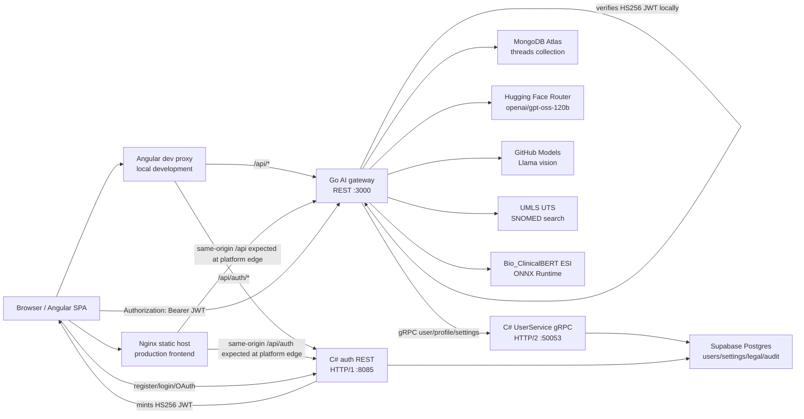

# ORSA
https://orsa.vercel.app/

ORSA is a production-oriented, multi-service AI health companion. The system gives users a secure chat experience for general health Q&A (lifestyle, nutrition, and human-body science), symptom triage, report review, attachment ingestion, profile-controlled personalization, legal consent capture, email-verified onboarding, and persisted conversation history.

The architecture is intentionally split by business responsibility:

- The Angular frontend owns the browser experience.
- The Go service owns the authenticated REST API, chat persistence, attachment ingestion, general health Q&A, and the clinical triage workflow.
- The C# service owns identity, session issuance, legal acceptance, profile settings, and Supabase/Postgres persistence.
- The protobuf contract defines stable internal service-to-service APIs.
- The local model artifacts provide the BERT-ESI specialist signal used during triage reconciliation.

## Table of Contents

- [Architecture Summary](#architecture-summary)
- [Repository Map](#repository-map)
- [System Diagram](#system-diagram)
- [Runtime Services](#runtime-services)
- [End-to-End Request Flows](#end-to-end-request-flows)
- [Clinical Triage Architecture](#clinical-triage-architecture)
- [Data Architecture](#data-architecture)
- [Authentication and Authorization](#authentication-and-authorization)
- [Privacy, Consent, and Safety Boundaries](#privacy-consent-and-safety-boundaries)
- [External AI and Clinical Integrations](#external-ai-and-clinical-integrations)
- [Configuration](#configuration)
- [Local Development](#local-development)
- [Docker Images](#docker-images)
- [Verification](#verification)
- [Production Readiness Notes](#production-readiness-notes)
- [Documentation Index](#documentation-index)

## Architecture Summary

ORSA is currently implemented as three deployable services plus shared contracts and model assets:

| Layer | Path | Runtime | Main responsibility |
| --- | --- | --- | --- |
| Web app | `frontend` | Angular 19, Nginx in production | User interface, routing, auth screens, chat UI, attachment selection, settings, profile, i18n, local cache |
| AI gateway | `services/go-ai-mongo` | Go 1.25+ | Browser-facing authenticated REST API, chat orchestration, MongoDB thread persistence, M0-M6 triage workflow, model integrations |
| Identity/profile engine | `services/csharp-supabase` | ASP.NET Core .NET 9 | Email/password auth, Google OAuth exchange, HS256 session issuance, gRPC user settings/profile/legal/persona APIs, Supabase/Postgres persistence |
| Internal contracts | `proto` | proto3 | Versioned gRPC contract between Go and C# |
| Clinical model artifacts | `models` | Bio_ClinicalBERT + ONNX Runtime | BERT-ESI specialist classifier inputs and ONNX artifacts |
| Operating docs/scripts | `docs`, `scripts` | Markdown, PowerShell, Python | Workflow contract, legal docs, startup helpers, model export/verification |

Important source-of-truth note: older architecture notes may mention a Node orchestrator. The current repository implementation has consolidated the browser-facing REST gateway into `services/go-ai-mongo`. The frontend talks to Go for `/api/*` except `/api/auth/*`, which is proxied directly to the C# auth service.

## Repository Map

```text
.
|-- frontend
|   |-- src/app
|   |   |-- core
|   |   |   |-- api.service.ts          # Typed browser API client and local fallback/cache behavior
|   |   |   |-- auth.service.ts         # Session persistence, login/register/Google flows, logout data clearing
|   |   |   |-- auth.guard.ts           # Route protection
|   |   |   |-- language.service.ts     # Language and RTL handling
|   |   |   |-- theme.service.ts        # Light/dark/system theme state
|   |   |   `-- models.ts               # Frontend DTOs
|   |   |-- features
|   |   |   |-- auth                    # Sign-in, Google callback, and email verification
|   |   |   |-- chat                    # Main chat, conversation list, uploads, quota display
|   |   |   |-- consent                 # Account creation and legal consent capture
|   |   |   |-- landing                 # Public entry page
|   |   |   |-- profile                 # Persona summary, consent, boundary prompt editor
|   |   |   `-- settings                # Theme, language, memory extraction, delete account
|   |   `-- shared                     # Logo, nav, rich reply formatter, translation pipe
|   |-- proxy.conf.json                # Dev proxy: /api/auth -> C#, /api -> Go
|   |-- nginx.conf                     # Static SPA hosting and security headers
|   `-- Dockerfile
|-- services
|   |-- go-ai-mongo
|   |   |-- cmd/orsa-ai-mongo/main.go   # Service bootstrap and dependency wiring
|   |   |-- internal/auth               # HS256 JWT verification
|   |   |-- internal/bert               # ONNX Runtime BERT-ESI predictor
|   |   |-- internal/config             # Env and .env loading
|   |   |-- internal/httpapi            # REST handlers, CORS, auth middleware, quotas, rate limits
|   |   |-- internal/llm                # OpenAI-compatible chat client used via the model pool
|   |   |-- internal/modelpool          # Round-robin text/vision provider pool
|   |   |-- internal/mongo              # Mongo index helpers
|   |   |-- internal/store              # Mongo-backed and in-memory chat stores
|   |   |-- internal/triage             # M0-M6 notebook workflow port
|   |   |-- internal/umls               # UMLS/SNOMED lookup client
|   |   |-- internal/userclient         # Dynamic gRPC client to C# UserService
|   |   |-- internal/vision             # GitHub Models vision/PDF extraction
|   |   `-- internal/workflow           # Locked workflow invariants and parity tests
|   `-- csharp-supabase
|       |-- Program.cs                  # Kestrel ports, DI, REST auth routes, startup schema ensure
|       |-- Data/OrsaDbContext.cs       # EF Core mapping to Supabase/Postgres tables
|       |-- Entities                    # Users, settings, legal acceptance, persona audit, email verification entities
|       |-- Services/AuthService.cs     # Register/login/Google OAuth, email verification, password hashing
|       |-- Services/EmailService.cs    # Resend transactional email (verification links)
|       |-- Services/SessionTokens.cs   # HS256 compact JWT issuer
|       |-- Services/UserGrpcService.cs # gRPC settings/profile/legal/persona/delete service
|       `-- Dockerfile
|-- proto
|   `-- user_service.proto              # Internal UserService contract
|-- models
|   |-- bert_esi                        # Fine-tuned checkpoint files
|   `-- bert_esi_onnx                   # ONNX Runtime model/tokenizer files
|-- docs
|   |-- architecture-analysis.md
|   |-- workflow-contract.md
|   |-- secrets-inventory.md
|   `-- legal
|-- scripts
|   |-- start-go-service.ps1
|   |-- start-csharp-service.ps1
|   |-- export_bert_esi_onnx.py
|   `-- verify_bert_esi_artifacts.ps1
|-- .env.example
|-- .gitignore
`-- README.md
```

## System Diagram



## Runtime Services

### Frontend (`frontend`)

The frontend is an Angular 19 standalone-component application. It is the only browser-facing user interface.

Primary responsibilities:

- Public landing route at `/`.
- Sign-in route at `/auth`.
- Google OAuth callback route at `/auth/google/callback`.
- Email verification route at `/verify-email`, which doubles as an onboarding "check your inbox" step.
- Legal consent and account creation route at `/consent`.
- Authenticated chat route at `/chat`.
- Authenticated profile route at `/profile`.
- Authenticated settings route at `/settings`.
- Email-verification onboarding: after email/password sign-up the user is held on `/verify-email` until the address is confirmed; the route guard redirects unverified users away from member-only routes. Google sign-ins are inherently verified and skip this step.
- Rich, ChatGPT/Claude-style rendering of assistant replies: headings, ordered/unordered lists (one level of nesting), fenced code blocks, inline code, bold/italic/strikethrough, sanitized links, blockquotes, horizontal rules, and tables — rendered through Angular bindings (never `innerHTML`) and styled responsively for desktop and mobile.
- Account management in settings: delete account (requires typing `DELETE` plus a final confirmation) and a confirmation prompt before sign-out.
- Session persistence in `localStorage` under `orsa-session`.
- Local user data cleanup on logout (and on account deletion) for keys beginning with ORSA health/session prefixes.
- Local chat cache partitioned by current session identity so the UI stays responsive if the backend temporarily fails.
- Attachment selection and upload orchestration.
- Per-user upload usage display using backend quota values merged with local advisory counters.
- Profile-context creation for consent-controlled personalization.
- Theme preference: `light`, `dark`, or `system`.
- Language preference: English, Arabic, Spanish, French, German, Hindi, and Chinese.
- RTL layout switching for Arabic through `document.documentElement.dir`.

Important frontend files:

- `frontend/src/app/core/api.service.ts` is the typed API client for chat, conversations, uploads, settings, profile, and notifications.
- `frontend/src/app/core/auth.service.ts` handles login, register, Google redirect, Google code exchange, email verification, account deletion, logout, and session persistence.
- `frontend/src/app/core/auth.guard.ts` protects authenticated routes: it redirects guests to `/auth?redirect=...` and unverified email/password users to `/verify-email`.
- `frontend/src/app/features/auth/verify-email.component.ts` verifies email tokens and renders the onboarding "check your inbox" awaiting state with a resend action.
- `frontend/src/app/features/chat/chat.component.ts` owns the main chat workflow, selected files, message stream, conversation list, and profile context attachment to each chat turn.
- `frontend/src/app/shared/formatted-message.component.ts` parses and renders assistant replies as the rich Markdown subset described above.
- `frontend/proxy.conf.json` maps local development API requests:
  - `/api/auth/*` -> `http://127.0.0.1:8085/auth/*`
  - `/api/*` -> `http://127.0.0.1:3000/*`
- `frontend/nginx.conf` hosts the production SPA on port `8080` and sets defensive headers including CSP, frame protection, no-sniff, referrer policy, permissions policy, and HSTS.

### Go AI Gateway (`services/go-ai-mongo`)

The Go service is the main application backend for authenticated product functionality after sign-in.

It exposes REST/JSON over HTTP on `HTTP_PORT`, default `3000`.

Primary responsibilities:

- Verify every non-health request using the HS256 session token minted by the C# service.
- Derive the authenticated user id from the verified JWT `sub` claim, never from a client-supplied user id header.
- Enforce CORS using `CORS_ALLOWED_ORIGINS`.
- Persist conversations and notebook state to MongoDB Atlas when `MONGODB_ATLAS_URI` is configured.
- Fall back to an in-memory thread store when MongoDB is absent or unavailable so local development remains usable.
- Answer general health, lifestyle, nutrition, and human-body-science questions conversationally when a turn is not a symptom-triage case.
- Run the M0-M6 clinical triage workflow for symptom/report-review cases.
- Permanently delete a user's chat history (Mongo) as part of account deletion.
- Call language models through a round-robin model pool (GPT-OSS via the Hugging Face Router plus optional GitHub Models and Gemini providers) for both text and vision.
- Load and run the BERT-ESI ONNX specialist classifier when ONNX Runtime and model artifacts are available.
- Call UMLS for SNOMED concept enrichment when `UMLS_API_KEY` is configured.
- Analyze image/PDF attachments through GitHub Models vision when `GITHUB_TOKEN` is configured.
- Extract readable PDF text directly before falling back to the vision model.
- Call the C# service over gRPC for settings, profile, and consent-related data.
- Enforce per-user chat rate limits and attachment quotas.

REST endpoints:

| Method | Path | Auth | Purpose |
| --- | --- | --- | --- |
| `GET` | `/healthz` | No | Health probe. Returns `{ status: "ok", service: "go-ai-mongo" }`. |
| `GET` | `/conversations` | Yes | Lists non-deleted conversation summaries for the authenticated user. |
| `GET` | `/conversations/{threadId}/messages` | Yes | Loads messages for a thread, or returns the default assistant greeting when empty. |
| `DELETE` | `/conversations/{threadId}` | Yes | Soft-deletes a conversation by setting `deleted = true`. |
| `POST` | `/conversations/{threadId}/restore` | Yes | Restores a soft-deleted conversation. |
| `POST` | `/chat` | Yes | Runs one turn: a general health Q&A answer or a triage/report-review turn, and returns the assistant reply. |
| `POST` | `/attachments` | Yes | Accepts multipart uploads, extracts/analyses summaries, and returns attachment references. |
| `GET` | `/settings` | Yes | Returns user settings plus attachment quota usage. |
| `PATCH` | `/settings` | Yes | Updates memory extraction and reminder settings. |
| `GET` | `/profile` | Yes | Returns user profile/persona summary and personalization boundary. |
| `PATCH` | `/profile` | Yes | Updates memory consent, persona summary, and workflow boundary. |
| `DELETE` | `/account` | Yes | Permanently deletes the user's chat history and, via C# gRPC, their account/profile data. |
| `GET` | `/notifications` | Yes | Returns current placeholder notification items. |

Important Go packages:

- `internal/config`: loads `.env` by walking upward from the working directory; process environment variables always win.
- `internal/httpapi`: request routing, auth middleware, CORS middleware, upload handling, quota, chat rate limiting, profile normalization.
- `internal/store`: `Store` interface with MongoDB and in-memory implementations.
- `internal/triage`: production port of the immutable notebook workflow plus the general health Q&A conversational path.
- `internal/bert`: WordPiece tokenizer and ONNX Runtime classifier wrapper.
- `internal/modelpool`: round-robin pool that load-balances text and vision calls across the configured providers.
- `internal/llm`: OpenAI-compatible `/chat/completions` client used through the model pool.
- `internal/vision`: image/PDF attachment extraction through GitHub Models plus local PDF text extraction.
- `internal/umls`: UMLS CAS ticket workflow and SNOMED search.
- `internal/userclient`: dynamic protobuf gRPC client to C# without generated Go stubs.
- `internal/workflow`: locked workflow constants and invariant tests.

### C# Supabase Engine (`services/csharp-supabase`)

The C# service owns user identity, session issuance, legal acceptance persistence, profile settings, and the authoritative Supabase/Postgres data model for users.

It exposes two protocols on separate ports:

- REST auth and health over HTTP/1 on `HEALTH_PORT`, default `8085`.
- gRPC over HTTP/2 on `GRPC_PORT`, default `50053`.

Primary responsibilities:

- Register email/password users.
- Login email/password users.
- Redirect users to Google OAuth.
- Exchange Google OAuth authorization codes for ORSA sessions.
- Link Google sign-in to an existing email/password account with the same address (provider becomes `both`) instead of creating a duplicate.
- Issue and verify single-use email verification tokens, and resend them on request.
- Activate a password set on an existing Google-only account only after the emailed link is opened (stored as a pending hash until then).
- Send transactional verification email (HTML + plain text) through the Resend API; missing configuration degrades to a logged no-op.
- Permanently delete a user and all of their Postgres-side records on account deletion.
- Enforce one account per email with a case-insensitive unique index.
- Mint compact HS256 JWT session tokens with 7-day TTL that carry the email-verified state.
- Hash passwords with PBKDF2-SHA256 using 600,000 iterations.
- Transparently rehash older lower-iteration password hashes on successful login.
- Rate-limit auth endpoints per client IP: 10 requests per minute.
- Store users, settings, legal acceptances, persona audit records, and email verifications in Supabase/Postgres.
- Fall back to EF Core in-memory database when `SUPABASE_DB_CONNECTION_STRING` is unset.
- Ensure required Postgres tables/columns/indexes exist at startup through idempotent SQL.
- Serve the internal `orsa.user.v1.UserService` gRPC API.

REST endpoints:

| Method | Path | Purpose |
| --- | --- | --- |
| `GET` | `/healthz` | Health probe. Returns `{ status: "ok", service: "csharp-supabase" }`. |
| `POST` | `/auth/register` | Creates a new email/password user (unverified) and returns a session token, or, for an existing Google-only account, stores a pending password and emails a verification link instead of returning a session. |
| `POST` | `/auth/login` | Verifies password credentials and returns a session token; reports `email_not_found` and `use_google` cases distinctly. |
| `GET` | `/auth/google` | Sets an OAuth state cookie and redirects to Google. |
| `POST` | `/auth/google/exchange` | Validates OAuth state, exchanges code with Google, creates or links the user, and returns a session token. |
| `POST` | `/auth/verify-email` | Consumes a verification token, marks the email verified (activating any pending password), and returns a refreshed session token. |
| `POST` | `/auth/resend-verification` | Re-sends a verification email for an unverified account; always returns the same response to avoid account enumeration. |

gRPC methods from `proto/user_service.proto`:

| Method | Request | Response | Purpose |
| --- | --- | --- | --- |
| `GetSettings` | `UserIdRequest` | `UserSettings` | Reads or creates user settings. |
| `UpdateSettings` | `UpdateSettingsRequest` | `UserSettings` | Updates memory extraction and reminder settings with proto3 optional presence. |
| `GetProfile` | `UserIdRequest` | `ProfileResponse` | Reads display/profile/persona data. |
| `UpdateProfile` | `UpdateProfileRequest` | `ProfileResponse` | Updates memory consent, persona summary, workflow boundary, and boundary prompt. |
| `RecordLegalAcceptance` | `LegalAcceptanceRequest` | `WriteAck` | Writes a versioned legal acceptance record. |
| `WritePersonaAudit` | `PersonaAuditRequest` | `WriteAck` | Writes persona extraction audit metadata and, on success, updates stored persona JSON. |
| `DeleteUser` | `UserIdRequest` | `WriteAck` | Permanently deletes the user and all of their settings, legal acceptance, persona audit, email verification, and attachment usage rows. |

### Shared Proto Contract (`proto/user_service.proto`)

The protobuf file is the internal API contract between services. It uses package `orsa.user.v1` and defines:

- `UserIdRequest`
- `UserSettings`
- `UpdateSettingsRequest`
- `ProfileResponse`
- `UpdateProfileRequest`
- `LegalAcceptanceRequest`
- `PersonaAuditRequest`
- `WriteAck`
- `UserService`

The C# service compiles this proto as a server stub through `Grpc.Tools`.

The Go service currently builds matching dynamic protobuf descriptors in code instead of requiring generated Go stubs. This keeps the Go service easy to build in environments without `protoc`, but it means contract changes must be reflected in both `proto/user_service.proto` and `internal/userclient/userclient.go`.

## End-to-End Request Flows

### 1. Email Registration

1. User visits `/consent`.
2. User accepts the legal terms and chooses whether memory extraction is enabled.
3. Angular calls `POST /api/auth/register`.
4. Angular dev proxy routes this to C# `POST /auth/register` on port `8085`.
5. C# validates email/password and password length.
6. If the email already belongs to a password account, C# returns a conflict; Angular then tries to sign the user in with the supplied credentials, sending them to their existing account or to `/auth` with the email pre-filled.
7. If the email belongs to a Google-only account, C# stores the password as a *pending* hash, emails a verification link, and returns no session (the link must be opened to activate the password).
8. Otherwise C# creates a `users` row with:
   - UUID id
   - normalized email
   - username from email prefix
   - PBKDF2-SHA256 password hash
   - `auth_provider = "email"`
   - `email_verified = false`
   - `created_at`
9. If a legal version was provided, C# writes a `legal_acceptances` row.
10. C# issues and emails a verification token, then returns a compact HS256 JWT carrying `email_verified = false`.
11. Angular persists the session in `localStorage` under `orsa-session` and navigates to `/verify-email`, the onboarding "check your inbox" step.
12. Chat and uploads stay gated until the user opens the emailed link, which marks the email verified and forwards them to `/chat`.

### 2. Email Login

1. User submits `/auth`.
2. Angular calls `POST /api/auth/login`.
3. C# looks up the user by email across providers (so a linked Gmail account resolves to one user).
4. A missing account returns `email_not_found`; a Google-only account returns `use_google` so the UI can steer the user to the Google button.
5. Password verification uses PBKDF2-SHA256 and constant-time comparison.
6. If the stored hash has a weaker work factor, C# rehashes it with the current 600,000-iteration policy.
7. C# updates `last_login`.
8. C# returns a compact HS256 JWT carrying the current `email_verified` state.
9. Angular stores the token and uses it as `Authorization: Bearer <token>` for Go API calls; an unverified user is routed to `/verify-email` first.

### 3. Google OAuth Login or Signup

1. Angular calls `window.location.href = "/api/auth/google"`.
2. C# creates a random OAuth state value.
3. C# stores the state in an HttpOnly `orsa-oauth-state` cookie.
4. C# redirects to Google with `openid email profile` scopes.
5. Google redirects back to `/auth/google/callback`.
6. Angular posts the authorization code and state to `/api/auth/google/exchange`.
7. C# validates the returned state against the single-use cookie.
8. C# exchanges the code for a Google access token.
9. C# fetches Google user info.
10. C# finds the user by Google subject id or by email. An existing email/password account with the same address (for example a `@gmail.com` user) is linked: its provider becomes `both` and the email is marked verified. Otherwise a new Google user is created.
11. C# returns an ORSA HS256 session token (Google accounts are always verified).
12. Angular persists the ORSA session and continues to `/chat`.

### 4. Authenticated Chat Turn

1. User opens `/chat`; the route guard requires an active local session and a verified email (unverified users are sent to `/verify-email`).
2. Angular loads conversations, messages, settings, and profile data from Go.
3. Angular sends `POST /api/chat` with:
   - `threadId`
   - user `content`
   - optional attachment references
   - profile context created from the current consent/profile state
4. Go verifies the `Authorization` JWT locally with `ORSA_SESSION_SECRET`.
5. Go extracts the user id from the JWT `sub` claim.
6. Go rate-limits chat to 30 messages per user per minute.
7. Go loads the thread from MongoDB, or initializes a new notebook state if none exists.
8. If the frontend did not send profile context, Go fetches profile context from C# over gRPC.
9. Go normalizes profile context:
   - disabled consent clears persona summary and workflow boundary
   - enabled consent builds a boundary prompt
10. Go runs the engine, which routes the turn to either a general health Q&A answer (lifestyle, nutrition, human-body science, and other non-triage health questions) or the M0-M6 symptom/report-review triage workflow.
11. Go appends the user and assistant messages to state.
12. Go saves the thread to MongoDB or memory store.
13. Go returns the assistant message, and when final triage occurs also returns:
   - reconciliation result
   - warnings
   - FHIR bundle JSON
   - differential list
14. Angular renders the response and updates local cache.

### 5. Attachment Upload and Report Review

1. User selects up to the allowed daily attachment quota from the chat screen.
2. Angular posts multipart files to `POST /api/attachments`.
3. Go enforces:
   - maximum 5 files per request
   - maximum 5 attachments per user per UTC day
   - maximum request body of 64 MiB
   - maximum file read of 12 MiB per attachment
4. Go detects MIME type using request headers, file bytes, extension fallback, and `http.DetectContentType`.
5. For PDFs, Go first tries direct text extraction with `github.com/ledongthuc/pdf`.
6. For supported image/PDF media, Go calls GitHub Models vision when configured.
7. For unsupported, unreadable, too-large, or unavailable vision cases, Go returns an explicit status and summary.
8. Angular receives attachment references with:
   - `id`
   - `fileName`
   - `contentType`
   - `storageUri`
   - `summary`
   - `analysisStatus`
   - quota usage
9. The next chat call includes these attachment references.
10. The triage engine records attachment summaries in notebook state as M0 input.
11. If the interaction is report-review oriented, the engine enters report review instead of symptom triage.

### 6. Settings and Profile Flow

1. Angular calls `GET /api/settings` or `GET /api/profile`.
2. Go verifies the JWT and calls C# gRPC.
3. C# reads or creates `user_settings`.
4. `health_profile_data` JSON stores:
   - `memoryExtractionEnabled`
   - `remindersEnabled`
   - `personaSummary`
   - `workflowBoundary`
   - `boundaryPrompt`
   - persona extraction metadata when present
5. Go maps the C# response to frontend JSON.
6. Angular uses the returned profile to build per-thread `profileContext`.
7. The clinical workflow may use enabled profile context only for communication style and workflow boundaries, never clinical evidence or urgency reduction.

### 7. Account Deletion

1. User opens `/settings` and chooses **Delete account**.
2. The UI requires typing `DELETE` (exact, capitalized) and then a final confirmation dialog.
3. Angular calls `DELETE /api/account` with the session bearer token.
4. Go verifies the JWT, derives the user id, and deletes all of the user's threads from MongoDB.
5. Go calls C# `DeleteUser` over gRPC, which removes the user row and all settings, legal acceptance, persona audit, email verification, and attachment usage records.
6. Angular clears the local session and health caches and returns to the landing page.

## Clinical Triage Architecture

The triage workflow in `services/go-ai-mongo/internal/triage` is a Go port of the immutable notebook contract described in `docs/workflow-contract.md`.

Locked constants:

- `LOOP_CAP = 5`
- `MAX_MESSAGES = 20`

State keys:

- `chief_complaint`
- `symptoms`
- `onset`
- `severity`
- `location`
- `modifiers`
- `demographics`
- `vitals`
- `risk_factors`
- `red_flags`
- `attachments_summary`
- `turn_count`
- `messages`

Pipeline stages:

| Stage | Name | Implementation responsibility |
| --- | --- | --- |
| M0 | Attachments | Merge pre-analyzed attachment summaries into state. Surface unreadable/uncertain uploads explicitly. |
| M1 | Scope gate | On the first turn only, separate symptom/report-review cases (which continue into triage) from general health questions (which are answered conversationally) and out-of-scope messages (which are declined). |
| M2 | Extraction | Extract structured clinical state from the patient message and merge into notebook state. |
| State merge | Deterministic merge | Preserve existing state, add new facts, capture vitals/demographics/risk factors, sanitize noisy symptoms. |
| UMLS | Concept coding | Look up SNOMED concepts for extracted symptoms when configured. |
| Red flags | Fast path | Detect affirmed red flags and bypass further clarification when present. Negated red flags are suppressed. |
| M3 | Sufficiency | Decide whether enough information exists for triage. |
| M4 | Clarification | Ask one focused follow-up when the case is not yet sufficient and under the loop cap. |
| BERT | Specialist ESI | Run Bio_ClinicalBERT ONNX classifier for an independent ESI signal. |
| M5 | GPT triage | Ask GPT-OSS for structured triage reasoning, likely condition, specialty, confidence, and ESI. |
| Reconcile | Escalate-only | Final ESI is the most urgent level among BERT, GPT, and red-flag/vitals floor. Silent de-escalation is forbidden. |
| M6 | Patient response | Generate patient-facing guidance with safety disclaimers and escalation instructions. |
| FHIR | Bundle output | Emit a FHIR R5 collection Bundle with triage observation, conditions, flags, and vitals. |

Escalate-only reconciliation:

- ESI levels are `1` through `5`, where `1` is most urgent and `5` is least urgent.
- The final ESI is the minimum numeric value among:
  - BERT ESI
  - GPT ESI
  - red-flag/vitals floor, when present
- If GPT attempts to reduce urgency relative to BERT, the result records `gpt_wanted_deescalate = true`.
- If BERT and GPT differ by at least 2 levels, the result records `disagreement = true`.
- Danger-zone vitals can force an ESI-2 floor:
  - SpO2 below 92
  - respiratory rate above 28 or below 8
  - heart rate above 130 or below 40

Profile/persona boundary:

- Persona/profile extraction is deliberately outside the clinical state.
- Profile context can personalize response style only when consent is enabled.
- Profile context is never treated as clinical evidence.
- Profile context cannot reduce urgency, override red flags, change diagnosis, or bypass escalation.

Fallback behavior:

- If GPT-OSS is unavailable, structured steps use safe fallback JSON and M6 uses deterministic safe response text.
- If BERT or ONNX Runtime is unavailable, the BERT signal defaults to ESI-5 with 0 confidence, which is neutral under escalate-only reconciliation.
- If UMLS is unavailable, concept coding is skipped and triage continues.
- If vision is unavailable, attachment summaries explicitly say extraction is unavailable and the workflow continues safely.
- If MongoDB is unavailable, chat uses an in-memory store and the user still receives a response.

## Data Architecture

### MongoDB Atlas

MongoDB stores chat threads in the `threads` collection.

Thread document shape:

```json
{
  "user_id": "uuid-from-session-sub",
  "thread_id": "thread identifier",
  "title": "conversation title",
  "state": {
    "chief_complaint": "",
    "symptoms": [],
    "onset": "",
    "severity": "",
    "location": "",
    "modifiers": [],
    "demographics": { "age": null, "sex": null },
    "vitals": { "hr": null, "rr": null, "spo2": null, "temp": null, "bp": "" },
    "risk_factors": [],
    "red_flags": [],
    "attachments_summary": [],
    "turn_count": 0,
    "messages": []
  },
  "deleted": false,
  "created_at": "UTC datetime",
  "updated_at": "UTC datetime"
}
```

Indexes created by the Go service:

- `user_threads_updated` on `{ user_id: 1, updated_at: -1 }`
- `user_threads_search` text index on `{ user_id: 1, title: "text" }`

The store interface also supports `ChangedThreads(userID, since)` for persona extraction or future background processing.

### Supabase/Postgres

The C# service maps EF Core entities to these tables:

#### `users`

| Column | Purpose |
| --- | --- |
| `id uuid primary key` | ORSA user id; becomes JWT `sub`. |
| `email text` | Normalized email. A case-insensitive unique index (`ux_users_email_lower`) enforces one account per address. |
| `username text` | Display name or email prefix. |
| `password_hash text` | PBKDF2-SHA256 hash for email/password users. |
| `pending_password_hash text` | Password awaiting email confirmation when set on an existing Google account; promoted to `password_hash` on verification. |
| `google_sub text` | Google stable subject id for OAuth users. |
| `auth_provider text` | `email`, `google`, or `both` for linked accounts. |
| `email_verified boolean` | Whether the email address has been confirmed. Google accounts are verified on creation. |
| `created_at timestamptz` | Account creation time. |
| `last_login timestamptz` | Last successful login. |

#### `user_settings`

| Column | Purpose |
| --- | --- |
| `user_id uuid primary key` | One settings row per user. |
| `theme_preference text` | Preserved settings field, currently defaulted to `system`. |
| `health_profile_data jsonb` | Main profile/persona/settings JSON document. |
| `updated_at timestamptz` | Last settings/profile update time. |

`health_profile_data` stores memory consent, reminders, persona summary, workflow boundary, boundary prompt, persona extraction JSON, persona model id, prompt hash, and persona update timestamp.

#### `legal_acceptances`

| Column | Purpose |
| --- | --- |
| `id uuid primary key` | Legal acceptance event id. |
| `user_id uuid` | User who accepted. |
| `terms_version text` | Terms version accepted. |
| `privacy_version text` | Privacy policy version accepted. |
| `consent_version text` | Health data/AI consent version accepted. |
| `accepted_at timestamptz` | Acceptance time. |

Index:

- `ix_legal_acceptances_user_accepted` on `(user_id, accepted_at)`

#### `persona_audit_records`

| Column | Purpose |
| --- | --- |
| `id uuid primary key` | Audit record id. |
| `user_id uuid` | User whose persona extraction ran. |
| `source_thread_ids jsonb` | Source chat threads used. |
| `prompt_hash varchar(128)` | Hash of extraction prompt. |
| `model_id varchar(128)` | Model used for extraction. |
| `status varchar(32)` | Extraction status. |
| `extracted_json jsonb` | Extracted persona JSON, or normalized error payload. |
| `error text` | Error detail when failed. |
| `run_at timestamptz` | Extraction run time. |

Index:

- `ix_persona_audit_user_run` on `(user_id, run_at)`

#### `email_verifications`

| Column | Purpose |
| --- | --- |
| `id uuid primary key` | Verification record id. |
| `user_id uuid` | User the token belongs to. |
| `token_hash text` | SHA-256 hash of the single-use token; the raw token is only ever emailed. |
| `expires_at timestamptz` | Expiry (24 hours after issue). |
| `consumed_at timestamptz` | When the token was used, or null while pending. |
| `created_at timestamptz` | Token issue time. |

### Browser Local Storage

The browser uses local storage for session and UX resilience. Important keys/prefixes:

- `orsa-session`: current session identity and JWT.
- `orsa-chat-history-v1:*`: per-session chat cache.
- `orsa-attachment-count`: local advisory upload count.
- `orsa-attachment-count-day`: UTC day key for local upload usage.
- `orsa-memory-enabled`: local setting fallback.
- `orsa-persona-summary`: local profile fallback.
- `orsa-workflow-boundary`: local profile fallback.
- `orsa-display-name`: local display fallback.
- `orsa-location`: local location fallback.
- `orsa-last-persona-run`: local profile fallback.
- `orsa-legal-version`: local consent version marker during signup.
- `orsa-legal-accepted-at`: local consent timestamp marker during signup.

On logout, `AuthService` removes local keys with ORSA session/health prefixes to reduce persistence of health data on shared devices.

## Authentication and Authorization

ORSA uses its own compact JWT session token for application authentication.

Token issuer:

- C# `SessionTokens.Issue(...)`

Token verifier:

- Go `internal/auth.Verify(...)`

Algorithm:

- HS256 only.
- `alg: none` and any non-HS256 algorithm are rejected.

Claims:

| Claim | Purpose |
| --- | --- |
| `sub` | User UUID; authoritative identity for Go API requests. |
| `email` | Convenience display/account value, not used as authorization source. |
| `email_verified` | Whether the address is confirmed; drives client-side gating of chat/uploads until verification. |
| `iat` | Issued-at Unix timestamp. |
| `exp` | Expiry Unix timestamp. |

Session lifetime:

- 7 days.

Shared secret:

- `ORSA_SESSION_SECRET`
- `SESSION_SECRET` is accepted as an alias.
- If neither is set, both services fall back to `orsa-dev-insecure-session-secret-change-me` for local development and log a warning.
- Production must set a strong `ORSA_SESSION_SECRET`.

Authorization behavior:

- Go requires `Authorization: Bearer <token>` for every route except `GET /healthz`.
- Go places the verified JWT subject in request context.
- Go never trusts user ids from request body, query string, or custom headers for ownership.
- MongoDB queries are scoped by authenticated `user_id`.
- C# auth endpoints are public but rate-limited per IP.

## Privacy, Consent, and Safety Boundaries

ORSA handles health-related user data, so the architecture separates clinical state, profile personalization, and legal consent.

Core boundaries:

- Chat triage state is stored in MongoDB by user/thread.
- User account/settings/legal/persona audit data is stored in Supabase/Postgres.
- Persona/profile data remains out-of-band from M1-M6 clinical extraction and reconciliation.
- Profile context is injected only as a bounded prompt when consent is enabled.
- Disabling consent clears persona summary and workflow boundary before a chat turn reaches the triage model.
- Attachment analysis never invents findings. Unreadable, blurry, unsupported, or unavailable uploads are explicitly surfaced.
- Red flags and danger-zone vitals can only increase urgency.
- Reconciliation forbids silent de-escalation.
- Patient responses must remain triage guidance, not final diagnosis.

Security controls currently implemented:

- HS256 session verification in Go.
- 7-day session expiry.
- Password hashing with PBKDF2-SHA256 and strong work factor.
- Constant-time password hash comparison.
- Google OAuth state cookie validation.
- Auth endpoint rate limiting.
- Go chat endpoint per-user rate limiting.
- Go CORS allowlist, no wildcard.
- Nginx security headers for the frontend image.
- Logout (and account deletion) clears locally cached PHI/session data prefixes.
- Email verification gates chat/uploads for email/password accounts until the address is confirmed.
- Account deletion removes all server-side user data across MongoDB and Postgres.
- One account per email enforced by a case-insensitive unique index.
- Production secrets are kept out of git through `.env` and `.gitignore`.

## External AI and Clinical Integrations

### GPT-OSS

Configured through:

- `GPT_OSS_ENDPOINT`, default `https://router.huggingface.co/v1`
- `GPT_OSS_MODEL_ID`, default `openai/gpt-oss-120b`
- `GPT_OSS_AUTH_TOKEN`
- `HF_TOKEN` or `HUGGING_FACE_API_KEY` are accepted token aliases.

Used for:

- M1 scope gate
- M2 extraction
- M3 sufficiency
- M4 clarification
- M5 structured triage
- M6 patient response
- General health Q&A responses
- Report review text generation

The client uses OpenAI-compatible `/chat/completions` requests and robust JSON extraction for structured steps. GPT-OSS is one provider in the round-robin model pool; when `GITHUB_TOKEN` or `GEMINI_API_KEY` are configured, GitHub Models and Gemini join the rotation for both text and vision. Providers without a configured token are dropped, so a minimal GPT-OSS-only setup behaves exactly as before.

### BERT-ESI ONNX

Configured through:

- `BERT_BASE_MODEL_ID`, default `emilyalsentzer/Bio_ClinicalBERT`
- `BERT_ESI_MODEL_DIR`, default `./models/bert_esi`
- `BERT_ESI_ONNX_DIR`, default `./models/bert_esi_onnx`
- `ONNX_RUNTIME_LIB` or `ONNXRUNTIME_SHARED_LIBRARY_PATH`

Used for:

- Specialist ESI prediction, labels `ESI-1` through `ESI-5`.

Runtime details:

- Requires CGo.
- Requires a 64-bit C compiler on Windows.
- Uses `github.com/yalue/onnxruntime_go`.
- Loads `vocab.txt` and `model.onnx`.
- Runtime accepts `model.onnx` either at:
  - `models/bert_esi_onnx/model.onnx`
  - `models/bert_esi_onnx/onnx/model.onnx`
- Large model artifacts are intentionally gitignored:
  - `models/**/*.onnx`
  - `models/**/*.safetensors`
  - `models/**/*.bin`
  - `models/**/pytorch_model*`

### UMLS / SNOMED

Configured through:

- `UMLS_API_KEY`

Used for:

- Looking up SNOMED CT concepts for extracted symptoms.
- Enriching M5 prompt payload.
- Adding coded Condition resources to the FHIR bundle when available.

The client uses the UMLS CAS flow:

- TGT from API key.
- Service ticket per search call.
- Conservative TGT cache of 7 hours.

### Vision Attachments

Configured through:

- `GITHUB_MODELS_BASE`, default `https://models.inference.ai.azure.com`
- `VISION_MODEL_ID`, default `meta/Llama-3.2-90B-Vision-Instruct`
- `GITHUB_TOKEN`

Used for:

- Clinical extraction summaries from image uploads.
- PDF/image report review support.

PDF text is extracted locally first. If readable PDF text is found, the system can avoid sending the PDF to the vision endpoint.

## Configuration

Copy `.env.example` to `.env` and fill in environment values. Both Go and C# walk up from their working directory to find the nearest `.env`. Existing process environment variables always override `.env` values.

### Shared

| Variable | Required in production | Purpose |
| --- | --- | --- |
| `ORSA_SESSION_SECRET` | Yes | Shared HS256 secret used by C# to mint and Go to verify session tokens. |
| `SESSION_SECRET` | Optional alias | Backward-compatible alias for `ORSA_SESSION_SECRET`. |

### Go AI Gateway

| Variable | Default | Purpose |
| --- | --- | --- |
| `HTTP_PORT` | `3000` | REST API listen port. |
| `PORT` | none | Alias used only when `HTTP_PORT` is absent. |
| `CORS_ALLOWED_ORIGINS` | `http://localhost:4200,http://127.0.0.1:4200` | Comma-separated browser origins allowed to call Go REST. |
| `MONGODB_ATLAS_URI` | empty | MongoDB connection string. Empty means in-memory fallback. |
| `MONGODB_DATABASE` | `orsa` | Mongo database name. |
| `UMLS_API_KEY` | empty | Enables UMLS/SNOMED lookup. |
| `BERT_BASE_MODEL_ID` | `emilyalsentzer/Bio_ClinicalBERT` | Reference base model id. |
| `BERT_ESI_MODEL_DIR` | `./models/bert_esi` | Fine-tuned checkpoint directory. |
| `BERT_ESI_ONNX_DIR` | `./models/bert_esi_onnx` | ONNX classifier directory. |
| `ONNX_RUNTIME_LIB` | empty | Absolute path to ONNX Runtime shared library. |
| `ONNXRUNTIME_SHARED_LIBRARY_PATH` | empty | Alias consumed by ONNX Runtime Go package. |
| `GITHUB_MODELS_BASE` | `https://models.inference.ai.azure.com` | Vision/text API base URL for GitHub Models. |
| `VISION_MODEL_ID` | `meta/Llama-3.2-90B-Vision-Instruct` | Vision model id. |
| `GITHUB_TOKEN` | empty | Enables vision attachment analysis and the GitHub Models text providers. |
| `GITHUB_GPT_MODEL_ID` | `openai/gpt-4.1` | Extra GitHub Models text/vision provider in the round-robin pool. |
| `GITHUB_LLAMA_MODEL_ID` | `meta/Llama-4-Maverick-17B-128E-Instruct-FP8` | Extra GitHub Models text/vision provider in the round-robin pool. |
| `GEMINI_BASE` | `https://generativelanguage.googleapis.com/v1beta/openai` | Gemini OpenAI-compatible base URL. |
| `GEMINI_MODEL_ID` | `gemini-2.5-flash` | Gemini model id; joins both pools when a key is set. |
| `GEMINI_API_KEY` | empty | Enables the Gemini provider. |
| `GPT_OSS_ENDPOINT` | `https://router.huggingface.co/v1` | GPT-OSS OpenAI-compatible API base URL. |
| `GPT_OSS_MODEL_ID` | `openai/gpt-oss-120b` | GPT-OSS model id. |
| `GPT_OSS_AUTH_TOKEN` | empty | GPT-OSS bearer token. |
| `HF_TOKEN` | empty | Token alias. |
| `HUGGING_FACE_API_KEY` | empty | Token alias. |
| `CSHARP_SUPABASE_GRPC_URL` | `localhost:50053` | C# gRPC target. |

### C# Supabase Engine

| Variable | Default | Purpose |
| --- | --- | --- |
| `GRPC_PORT` | `50053` | gRPC HTTP/2 listen port. |
| `HEALTH_PORT` | `8085` | REST auth and health HTTP/1 listen port. |
| `SUPABASE_DB_CONNECTION_STRING` | empty | Postgres/Supabase connection string. Empty means EF in-memory fallback. |
| `GOOGLE_CLIENT_ID` | empty | Enables Google OAuth redirect. |
| `GOOGLE_CLIENT_SECRET` | empty | Enables Google OAuth exchange. |
| `GOOGLE_REDIRECT_URI` | empty | OAuth callback URL registered with Google. |
| `RESEND_API_KEY` | empty | Enables sending verification email via Resend. When unset, email is a logged no-op and users land unverified. |
| `RESEND_FROM` | `ORSA <onboarding@resend.dev>` | From address; use a verified domain in production (the default sandbox sender only delivers to the Resend account owner). |
| `APP_BASE_URL` | `http://localhost:4200` | Frontend base URL used to build the verification link; set to the production site so emailed links resolve correctly. |

## Local Development

### Prerequisites

- Node.js 22+ and npm.
- Angular CLI via project dev dependencies.
- Go 1.25+.
- .NET SDK 9.
- MongoDB Atlas URI if persistent chat history is needed locally.
- Supabase/Postgres connection string if persistent user/profile data is needed locally.
- ONNX Runtime shared library and 64-bit C compiler if local BERT inference is needed.
- API tokens for GPT-OSS, GitHub Models, and UMLS if full AI integrations are needed.

### Recommended Startup Order

1. Create `.env`:

```powershell
Copy-Item .env.example .env
```

2. Start C# identity/profile service:

```powershell
.\scripts\start-csharp-service.ps1
```

Expected ports:

- gRPC: `localhost:50053`
- REST auth/health: `http://localhost:8085`

3. Start Go AI gateway:

```powershell
.\scripts\start-go-service.ps1
```

Expected port:

- REST API: `http://localhost:3000`

4. Start Angular:

```powershell
cd frontend
npm install
npm start
```

Expected URL:

- `http://localhost:4200`

Angular `ng serve` automatically uses `frontend/proxy.conf.json` from `angular.json`.

### Windows BERT/ONNX Notes

`github.com/yalue/onnxruntime_go` uses CGo. On Windows local runs need:

- 64-bit GCC, for example Chocolatey `mingw-w64`.
- ONNX Runtime DLL path in `ONNX_RUNTIME_LIB` or `ONNXRUNTIME_SHARED_LIBRARY_PATH`.
- `CGO_ENABLED=1`.

The helper script pins the expected 64-bit compiler path:

```powershell
.\scripts\start-go-service.ps1
```

Manual equivalent:

```powershell
$env:CC = "C:\ProgramData\chocolatey\lib\mingw-w64\tools\install\mingw64\bin\gcc.exe"
$env:CGO_ENABLED = "1"
$env:ONNXRUNTIME_SHARED_LIBRARY_PATH = "C:\path\to\onnxruntime.dll"
cd services\go-ai-mongo
go run .\cmd\orsa-ai-mongo
```

## Docker Images

### Frontend

Build:

```powershell
docker build -t orsa-frontend ./frontend
```

Runtime:

- Nginx unprivileged image.
- Exposes port `8080`.
- Health check: `http://127.0.0.1:8080/healthz`.
- Serves Angular build from `/usr/share/nginx/html`.

### Go AI Gateway

Build from repo root:

```powershell
docker build -f services/go-ai-mongo/Dockerfile -t orsa-go-ai-mongo .
```

Runtime:

- Debian slim runtime.
- Exposes port `3000`.
- Copies `models` into `/app/models`.
- Installs ONNX Runtime Linux shared library.
- Runs as non-root `orsa` user.
- Health check checks port `3000`.

### C# Supabase Engine

Build from repo root:

```powershell
docker build -f services/csharp-supabase/Dockerfile -t orsa-csharp-supabase .
```

Runtime:

- .NET ASP.NET 9 runtime.
- Exposes `8085` for REST auth/health and `50053` for gRPC.
- Runs as non-root `orsa` user.
- Health check: `http://127.0.0.1:8085/healthz`.

## Verification

Run the core checks from the repository root.

Frontend build:

```powershell
cd frontend
npm run build
```

Go tests:

```powershell
cd services\go-ai-mongo
go test ./...
```

C# build:

```powershell
cd services\csharp-supabase
dotnet build
```

BERT artifact verification:

```powershell
.\scripts\verify_bert_esi_artifacts.ps1
```

The verification script checks the canonical exported layout documented in `models/bert_esi_onnx/README.md`, including `models/bert_esi_onnx/onnx/model.onnx`. The Go runtime is slightly more permissive and can also load `models/bert_esi_onnx/model.onnx`.

If ONNX artifacts are missing, export from the fine-tuned checkpoint:

```powershell
pip install torch transformers optimum[onnxruntime] onnx onnxruntime safetensors
python scripts/export_bert_esi_onnx.py
```

Current Go test coverage includes:

- JWT signing and verification behavior.
- Config defaults and ONNX env aliases.
- Attachment upload handling and MIME detection.
- Profile-context boundary normalization.
- Vision/PDF behavior.
- Red-flag detection and negation handling.
- Fallback reply safety.
- State merge and deterministic extraction.
- Report-review routing.
- Reconciliation invariants.
- Workflow constants and message trimming.

## Production Readiness Notes

Required before live production:

- Set a strong `ORSA_SESSION_SECRET` in both Go and C# environments.
- Configure `SUPABASE_DB_CONNECTION_STRING`.
- Configure `MONGODB_ATLAS_URI`.
- Configure GPT-OSS, GitHub Models, and UMLS credentials if full AI functionality is required.
- Ensure ONNX Runtime shared library and BERT ONNX artifacts are present in the Go runtime image.
- For the Vercel + Hugging Face deployment, publish the combined backend Docker Space from `deploy/huggingface/backend` and route:
  - `/api/auth/*` from Vercel to the Space `/auth/*` path
  - `/api/*` from Vercel to the Space root paths served by the Go gateway
- Configure production `CORS_ALLOWED_ORIGINS` to exact frontend origins only.
- Use HTTPS at the edge.
- Treat `.env` and all tokens as secrets.

Current implementation constraints to account for:

- Attachment quota is in-memory and per Go process. A multi-replica deployment should move it to Redis, Postgres, or MongoDB.
- Chat rate limiting is in-memory and per Go process. A multi-replica deployment should use shared rate-limit storage.
- MongoDB fallback is in-memory and should be used only for development or degraded local demos.
- C# database fallback is EF in-memory and should be used only for local development.
- Startup SQL is idempotent and practical, but production schema management should eventually move to explicit migrations.
- The Go gRPC client mirrors protobuf descriptors dynamically; proto changes must be reflected in `internal/userclient`.
- Persona extraction audit APIs exist, but any background persona extraction worker must preserve the contract that persona data stays out of clinical evidence and reconciliation.
- Email registration records legal acceptance when a legal version is submitted. Google signup currently stores the accepted version in the browser before OAuth; server-side legal audit parity for Google-created accounts should be wired through `RecordLegalAcceptance`.
- The email signup request includes the initial memory extraction choice. Durable settings/profile state is still governed by the settings/profile APIs, so signup should explicitly persist that value server-side if first-run consent must be authoritative immediately.

## Documentation Index

- `docs/workflow-contract.md`: immutable triage workflow contract and model defaults.
- `docs/architecture-analysis.md`: original architecture analysis and integration notes.
- `docs/deployment.md`: Vercel + Hugging Face Docker Space deployment guide.
- `docs/secrets-inventory.md`: secret/configuration inventory.
- `docs/legal/terms-2026-06-09.md`: Terms and Conditions.
- `docs/legal/privacy-2026-06-09.md`: Privacy Policy.
- `docs/legal/health-data-ai-consent-2026-06-09.md`: Health Data and AI Processing Consent.
- `models/bert_esi/README.md`: fine-tuned checkpoint notes.
- `models/bert_esi_onnx/README.md`: ONNX export/runtime notes.
